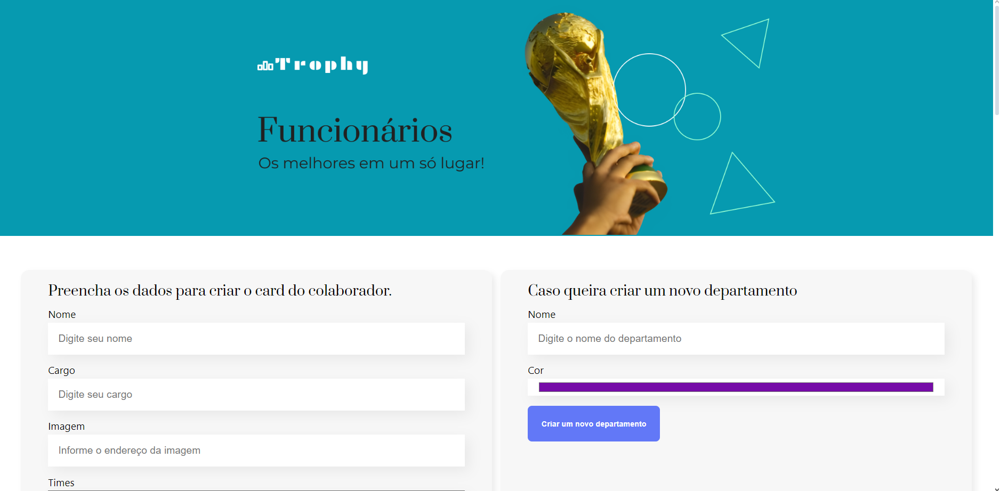
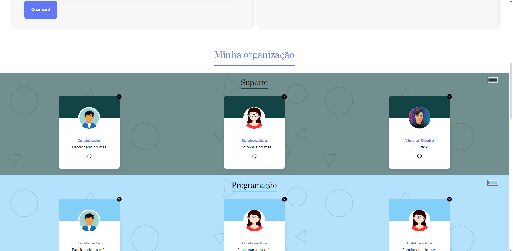

### Projeto Trophy, valorize melhor seu funcionário do mês com o Trophy 🏆
#### Fique a vontade para navegar, em caso de dúvidas estou disponível 24/7 para você 🫵

    
    

#### Link para o Site 🎯

    

#### ⬇️Pode me chamar no⬇️

 
    
    
    
     
    <h2>vinii.viniciusribeiro@gmail.com</h2>

#### Tecnologias utilizadas neste projeto 🤖

 
 
 
 
 
 
 

#### Conhecimentos Adquiridos durante o processo 🤓

- Criamos um novo projeto React;

- Criamos componentes funcionais;

- Estilizamos componentes com CSS;

- Analisamos as dependências do projeto;

- Analisamos os comandos disponíveis no package.json;

- Aprendemos como passar props para um componente;

- Renderizamos listas com o .map;

- Trabalhamos com elementos aninhados usando a prop children;

- Ouvimos elementos disparados pelo DOM: o onSubmit do nosso form;

- Controlar inputs utilizando value e onChange;

- Gerenciar o estado de um componente, utilizando o useState;

- Trabalhar com props que são funções;

- Manipular e transformar arrays de objetos;

- Filtrar itens de um array;

- Renderização condicional;

- Ler e interpretar mensagens de erro;

- Corrigir erros;

- Depurar o seu código com o debugger;

- Como clonar um projeto;

- A diferença entre clone e fork;

- Como instalar dependências de um projeto;

- Como rodar um projeto;

- Como criar uma nova prop;

- Como passar esta prop para inúmeros componentes;

- O que é uma closure e como utilizá-la a seu favor;

- Como instalar novas dependências na sua aplicação;

- Diferença entre export e export default;

- O que é Virtual DOM;

- Como o React escuta uma mudança e porque precisamos de um state para isto;

- Diferença de imperatividade e declaratividade;

- A diferença entre two-way data binding e one-way data binding;

- Por que o React utiliza one-way data binding;

- Por que utilizar id é importante no React;

- Como criar um ternário para renderizar de forma opcional;

- Como renderizar condicionais de outras formas;

- Como refatorar um componente sem atrapalhar a execução primária dele;

- A importância de se refatorar um componente em projetos React.
